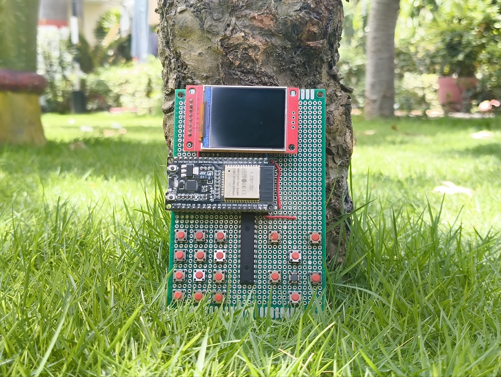
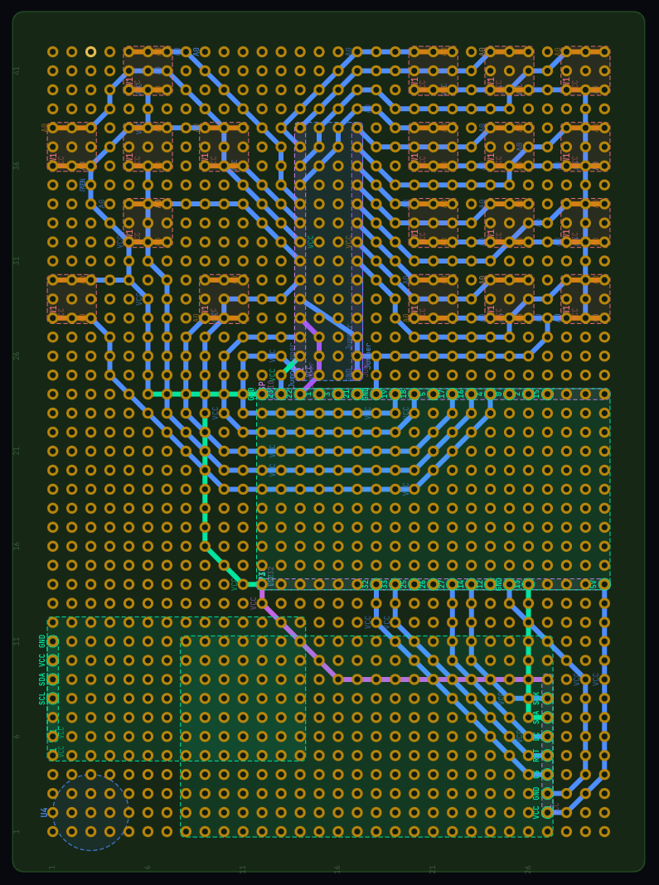
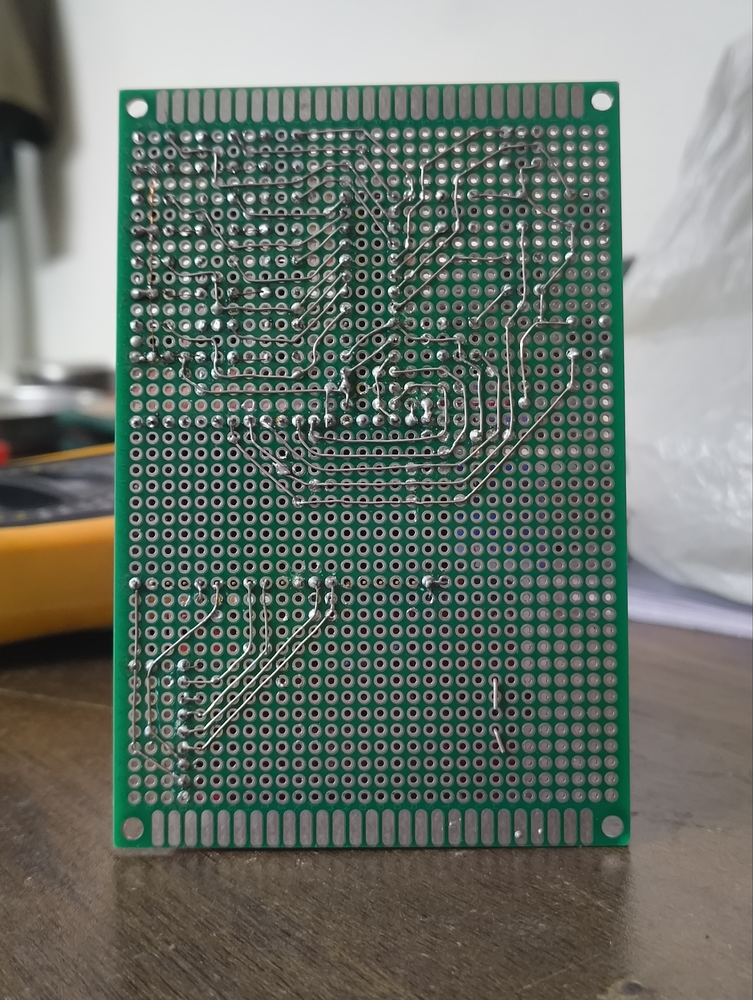

  

# StudySmart: T9-ESP32

StudySmart is a low-memory, AI-powered study assistant built on the ESP32 platform. It features an interactive "Ask?" mode for answering questions and a "Quiz" mode for testing knowledge, alongside productivity tools like a Notepad and Todo list.

The project is specifically optimized for hardware with limited RAM, utilizing a streaming JSON parser and server-side pagination to ensure only one "page" of content or one question is in memory at a time.

## Features

### Study AI
- **Ask?**: Ask any question and receive a detailed, paginated response optimized for a small screen.
- **Quiz**: Generate interactive quizzes on any topic. Features include:
  - Immediate feedback (Correct/Wrong) with explanations.
  - Final scoring and grading (A, B, C, etc.).
  - Persistent state on the server side using the device's MAC address.

### Productivity Tools
- **Notepad**: Create, view, edit, and rename notes. Includes a multi-line editor with cursor navigation.
- **Todo List**: Manage tasks with a simple check/uncheck interface.
- **WiFi Manager**: Scan for networks, connect with passwords, and monitor connection status.
- **Settings**: Configure timezones, sound (buzzer), and API base URL.

### Classic T9 Input
- Full text entry using a T9-style keypad mapping.
- Support for Shift/Caps Lock modes.
- Visual cursor and pending character feedback.

---

## Hardware Design

Before soldering, the entire circuit was meticulously planned using a custom **Perfboard Circuit Designing Canvas** built with Claude. This digital-first approach ensured efficient trace routing and component placement on the perfboard.

| Digital Layout | Physical Wiring |
| :---: | :---: |
|  |  |

The interactive design tool is available here: [Claude Perfboard Artifact](https://claude.ai/public/artifacts/75993db8-56cb-46ce-80a0-74412870ba9a).

To view or modify the layout for this project, simply import the `schematics/perfboard.json` file into the perfboard canvas.

---

## Hardware Requirements

- **Microcontroller**: ESP32
- **Display**: ST7735 1.8" TFT (160x128 resolution)
- **I/O Expander**: MCP23S17 (for the T9 keypad/navigation)
- **Audio**: Passive/Active Buzzer for haptic feedback
- **Buttons**: 3 primary buttons (Back, Enter, Menu) + 4x4 or similar Matrix Keypad connected via MCP23S17.

### Pin Mapping

| Component | ESP32 Pin | Note |
|---|---|---|
| **TFT CS** | 32 | HSPI |
| **TFT RST** | 33 | |
| **TFT DC** | 27 | |
| **TFT SCK** | 14 | HSPI SCK |
| **TFT MOSI** | 13 | HSPI MOSI |
| **MCP23S17 CS** | 22 | VSPI |
| **Buzzer** | 25 | |
| **Btn Back** | 4 | |
| **Btn Enter** | 16 | |
| **Btn Menu** | 17 | |

---

## Software & Libraries

### Arduino Libraries
- `Adafruit_GFX`
- `Adafruit_ST7735`
- `MCP23S17` (by Rob Tillaart)
- `ArduinoJson` (v6 or higher)
- `WiFi`, `HTTPClient`, `time` (Standard ESP32 libs)

### Backend Stack
The device communicates with the **StudySmart API** (Node.js/Express).
- **LLM**: NVIDIA NIM / Gemini API.
- **Database/Cache**: Redis (for session management and pagination).
- **Deployment**: Optimized for Render or local hosting.

---

## Setup Instructions

### 1. API Setup
Follow the instructions in `API.md` to deploy or run the StudySmart API.
1. Deploy the API (e.g., to Render).
2. Note the API Base URL (e.g., `https://studysmart-api-kray.onrender.com`).

### 2. Firmware Setup
1. Open `capstone_v1.ino` in the Arduino IDE or VS Code (with PlatformIO).
2. Ensure you have the required libraries installed.
3. (Optional) Modify `DEFAULT_SSID` and `DEFAULT_PASS` for automatic connection.
4. Upload to your ESP32.

### 3. Usage
- On first boot, you will be prompted to enable WiFi.
- Use the **Menu** button to access the App Launcher.
- In **Study AI**, you can configure the API Base URL in the settings menu if it differs from the default.

---

## T9 Keymap Reference

| Key | Mapping |
|---|---|
| 1 | 1 |
| 2 | abc2 |
| 3 | def3 |
| 4 | ghi4 |
| 5 | jkl5 |
| 6 | mno6 |
| 7 | pqrs7 |
| 8 | tuv8 |
| 9 | wxyz9 |
| 0 | (space) 0 |
| * | .,!?* (Hold for Caps/Shift) |
| # | #@_-+ |

---
